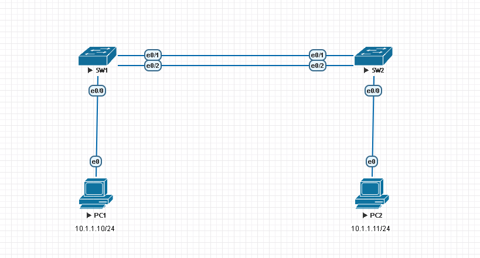
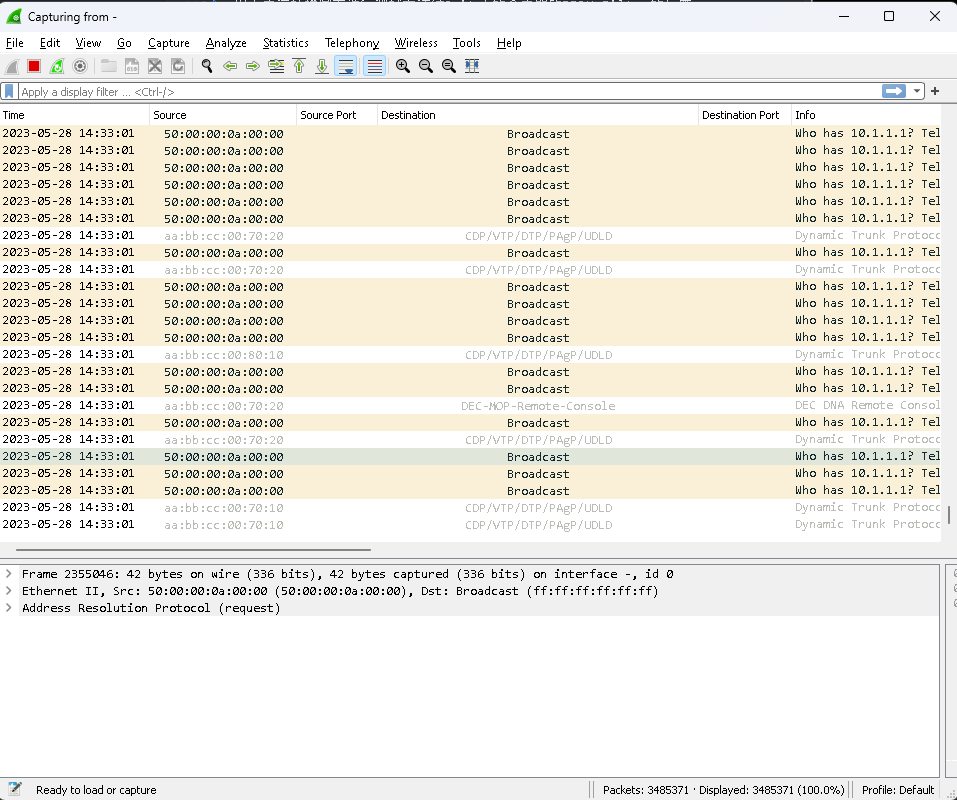

# Spanning-Tree #

## STP的演變 ## 

1. STP(802.1D) - 由IEEE發行，最初的STP標準
2. PVST+ - 由Cisco發行，對802.1D進行了增強，允許為每個VLAN建立一個實例
3. RSTP(802.1w) - 由IEEE發行，改進了收斂速度，但只允許單個STP實例，若不是使用Cisco設備，也建議至少開到此模式
4. Rapid PVST+ - 由Cisco發行，對802.1w進行了增強，擁有更快的收斂速度
5. Multiple Spanning-tree Protocol(802.1s) - 允許使用者建立獨立的實例，將多個VLAN段分配到實例中，減少消耗硬體資源和方便管理

## Max Age ## 

預設BPDU每2秒會發送一次Hello，Max Age為20秒

## Topology Change ## 

當拓樸中添加了新的裝置，Switch就會向Root Switch發送Topolohy Change Notification(TCN) BPDU，當Root Switch收到TCN BPDU後，會將Mac Address Table的Timeout時間縮短為15秒(Forward Delay)，所以Topology Change會持續35秒(Max Age + Forward Delay)

## STP選舉順序 ##

1. 選出Root Bridge 
2. 在非Root Bridge的每台Switch中選出Root Port
3. 在每一條線路中選出Designated Port
4. 非Root Port也非Designated Port的則會變成Block Port

## STP選舉比較順序 ##

>Hint:所有STP選舉都是比小

1. 比Bridge ID(選Root Bridge時使用，其餘不用)
2. 比root path cost(連到Root Bridge的路徑成本，請參考下面表格)
3. 比對方的Bridge ID 
4. 比對方的Port ID

## Path Cost ## 

|頻寬| 路徑成本(OLD) | 路徑成本(NEW)|
| --- | --- | --- |
| 4M  | 250 ||
| 10M | 100 ||
| 16M | 62  ||
| 45M | 39  || 
| 100M | 19 ||
| 155M | 14 ||
| 1G | 4 ||
| 10G | 2 ||

## UplinkFast ## 

UplinkFast是為了防止Access Layer交換機的Uplink發生故障時能夠快速進行轉換，不用等30秒的收斂時間，Uplinkfast會先將Block Port設定為Standby狀態，當Root Port斷掉時立刻轉換成Forwarding，不過在Rapid-pvst+中已經內建了uplinkfast，所以無需再下這條指令

>經由使用pvst開啟uplinkfast和開啟rapid-pvst+兩組進行測試發現到，雖說Rapid-pvst+內建了uplinkfast，但在Root Port斷掉時會Block Port會立即轉換成Root Port，ping卻會斷掉幾秒才繼續傳送，相反的使用pvst開啟uplinkfast在線路斷掉時會馬上轉成Root Port且網路不會中斷

```bash 
#查看是否開啟uplinkfast，若是在rapid-pvst+模式會顯示UplinkFast is enabled but inactive in rapid-pvst mode
show spanning-tree uplinkfast 
#開啟uplinkfast(全域配置)
spanning-tree uplinkfast 
```

## Backbonefast ## 

```bash
#查看是否開啟backbonefast，若是在rapid-pvst+模式會顯示BackboneFast is enabled but inactive in rapid-pvst mode
show spanning-tree backbonefast 
spanning-tree backbonefast 
```

## Portfast ## 

Portfast通常用於Access Layer連接使用者端的介面，Portfast跳過Listening和Learning，直接將介面變成Forwarding，通常會與BPDU Guard一起使用，防止使用者攜帶自己的交換機接入機櫃造成Topology Change，開啟BPDU的介面只要接收到BPDU就會將介面變成err-disable，要復原只能由管理員手動shutdown再no shutdown，再下面的bpduguard會寫到如何進行自動復原err-disable 

```bash
int range e0/0-3 
    spanning-tree portfast edge 
    spanning-tree bpduguard enable 
```

## BPDU Guard ## 

上面已經介紹過如何開啟bpduguard，接下來就要介紹如何將err-disable的介面進行手動以及自動復原

查看被err-disable的介面 

```bash
show interface status err-disabled 
```

手動復原

```bash 
#先將介面關閉
shutdown 
#再開啟介面即可
no shutdown 
```

自動復原

```bash
#errdisable的原因，可以用下面提供的指令查看
errdisable recovery cause bpduguard 
#recovery間隔時間，單位為秒
errdisable recovery interval 30 
```

查看命令(很有用，需熟練)

```bash
#查看被err-disable的原因
show errdisable detect 
#查看甚麼原因有啟用errdiable recovery
show errdisable recovery 
```

## BPDU Filter ##

啟用BPDU Filter的介面將不接收也不發送BPDU，相當於關掉STP，不建議打開BPDU Filter，除非在必須使用的環境中，若是有，也不要在連接交換器的介面開啟他，否則可能造成迴圈

```bash
#全域開啟BPDU Filter，這會使所有開啟Portfast的介面不傳送也不接收BPDU
spanning-tree portfast edge bpdufilter default 
int e0/0 #介面需開啟portfast才會生效
    spanning-tree portfast edge 
#在介面中開啟BPDU Filter 
int e0/0 
    spanning-tree portfast edge 
    spanning-tree bpdufilter enable 
```

根據這張拓樸圖來進行測試在連結Switch的介面開啟BPDU Filter的反應 



SW1 

```bash
int range e0/0-2 
    spanning-tree portfast edge 
    spanning-tree bpdufilter enable 
```

SW2 

```bash
int range e0/0-2
    spanning-tree portfast edge 
    spanning-tree bpdufilter enable 
```

配置完成後，開啟Wireshark抓SW1介面e0/1的封包，並使用PC1 ping 8.8.8.8，可以看到造成了廣播風暴



## Root Guard ##

Root Guard通常會配置於Distrubution Layer接到Access Layer Switch的端口，防止Access Layer的Switch因為較低的priority而變成root bridge，造成Distrubution Layer Switch的介面變成Block Port


根據這張拓樸圖通常會在DSW1和DSW2的E0/1配置Root Guard，但配置Root Guard後會造成Root inconsistent，Switch將無法在此線路傳送資料，直到異常裝置停止傳送superior BPDUs

先讓DSW1成為Root Bridge 

```bash
#DSW1
spanning-tree vlan 1 priority 8192 
```

在DSW1和DSW2開啟Root Guard 

```bash
#DSW1
int e0/1 
    spanning-tree guard root 
#DSW2
int e0/1 
    spanning-tree guard root 
```

將ASW1的priority調整為0

```bash
#ASW1
spanning-tree vlan 1 priority 0
```

從DSW1的Console可以看到Root Guard將e0/1 Block掉了


使用show spanning-tree可以看到狀態變為BKN(Broken簡寫)


復原方法就是將ASW1的Priority調整回32768 

```bash
spanning-tree vlan 1 priority 32768 
```

介面unblocking


## Loop Guard ##


## Reference ## 

https://www.cisco.com/c/zh_tw/support/docs/lan-switching/spanning-tree-protocol/69980-errdisable-recovery.html