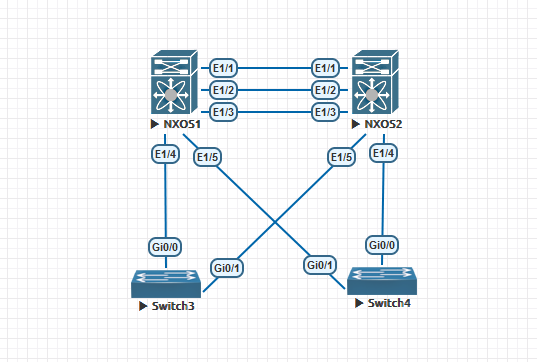

# Virtual Port-Channel(VPC) #

Cisco vPC (Virtual Port Channel) 是 Cisco NX-OS 系統中提供的一種高可用性技術，允許兩台 Nexus 交換機作為一個邏輯單元，實現連接至多個伺服器或其他交換機的多重鏈路聚合。vPC 提供了冗餘性和負載平衡，同時避免了傳統生成樹協議（STP）的限制，減少了封包的轉發延遲。它支持無環路架構，讓流量同時使用多條鏈路，提升了網路的效能與穩定性，是現代數據中心中常見的核心技術之一。

## VPC配置順序 ##

1. 配置Peer Keepalive 
2. 建立Peer Keepalive連接
3. 建立Peer link連接
4. 配置下游交換機的port-channel 

## 配置 ##

**Topology**



```bash
[NXOS1]
feature vpc 
feature interface-vlan 
feature lacp 
vlan 10 
    name IT
vlan 20 
    name RD
vlan 100 #建立專有VLAN劃分給Peer keepalive
    name keepalive 
vrf context keepalive #建立VRF並將vlan 100加入vrf，使keepalive流量只通過vrf keepalive進行傳輸，不影響到peer link 
int vlan 100 
    vrf member keepalive #將vlan 100劃分至vrf keepalive 
    ip address 192.168.100.1/24
    no shutdown 
int e1/1
    switchport 
    switchport access vlan 100 
    no shutdown 
vpc domain 1 
    peer-keepalive destination 192.168.100.2 source 192.168.100.1 vrf keepalive #建立keepalive連接
int e1/2-3 
    description VPC peer links 
    channel-group 100 mode active
    no shutdown 
int po 100 
    switchport 
    switchport mode trunk 
    switchport trunk allowed vlan 1,10,20 #允許相關VLAN流量，需與keepalive的VLAN分開，為了確保keepalive線路能夠和peer link流量隔離
    vpc peer-link #建立peer-link連接
    spanning-tree port type network 
int e1/4
    description connect to SW3 #連接至SW3
    switchport 
    switchport access vlan 10 
    channel-group 10 mode active
int po 10 
    switchport 
    switchport access vlan 10 
int e1/5 
    description connect to SW4 #連接至SW4
    switchport 
    switchport access vlan 20
    channel-group 20 mode active 
int po 20
    switchport 
    switchport access vlan 20 
[NXOS2]
feature vpc
feature interface-vlan 
feature lacp 
vlan 10 
    name IT
vlan 20 
    name RD 
vlan 100 #建立專有VLAN劃分給Peer keepalive
    name keepalive 
vrf context keepalive #建立VRF劃並將vlan 100加入vrf，使keepalive流量只通過vrf keepalive進行傳輸，不影響到peer link 
int vlan 100
    vrf member keepalive #將vlan 100劃分至vrf keepalive 
    ip address 192.168.100.2/24
    no shutdown 
int e1/1
    switchport 
    switchport access vlan 100 
    no shutdown 
vpc domain 1
    peer-keepalive destination 192.168.100.1 source 192.168.100.2 vrf keepalive #建立keepalive連接
int e1/2-3
    description VPC peer links 
    channel-group 100 mode active 
    no shutdown 
int po 100
    switchport 
    switchport mode trunk 
    switchport trunk allowed vlan 1,10,20 #允許相關VLAN流量，需與keepalive的VLAN分開，為了確保keepalive線路能夠和peer link流量隔離
    vpc peer-link #建立peer-link連接
    spanning-tree port type network 
int e1/4
    description connect to SW4 #連接至SW4
    switchport 
    switchport access vlan 20
    channel-group 20 mode active 
int po 20
    switchport access vlan 20 
int e1/5 
    description connect to SW3 #連接至SW3
    switchport 
    switchport access vlan 10 
    channel-group 10 mode active
int po 10
    switchport access vlan 10 
[SW3]
vlan 10
    name IT
int range ge0/0-1 
    description connect to VPC
    switchport mode access 
    switchport access vlan 10 
    channel-group 10 mode active 
[SW4]
vlan 20
    name RD
int range g0/0-1 
    description connect to VPC 
    switchport mode access
    switchport access vlan 20
    channel-group 20 mode active 
[Check]
show vpc peer-keepalive #查看keepalive狀態
show vpc #查看vpc狀態

```

## 優化 ##

```bash

```

## Refence ##

https://www.eflytop.com/post/vss-vs-vpc/

https://www.eflytop.com/post/vss-cfg-guildline/

Data Center VPC設計 https://community.cisco.com/t5/%E6%95%B0%E6%8D%AE%E4%B8%AD%E5%BF%83%E6%96%87%E6%A1%A3/vpc%E6%9C%80%E4%BD%B3%E5%AE%9E%E8%B7%B5-8-%E6%95%B0%E6%8D%AE%E4%B8%AD%E5%BF%83%E4%B9%8B%E9%97%B4vpc%E8%AE%BE%E8%AE%A1-dci-data-center-interconnect/ta-p/4364232
