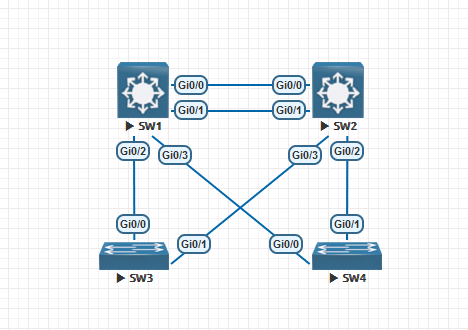

# Virtual Switch System #

適用於Catalyst 4500和6500交換機上的技術，將多台交換機合併成一台來預防單點失效，能使Layer 2與Layer 3合併

## 優缺點比較 ##

|協議|設備要求|支援協定|FHRP|
|---|---|---|---|
|Port-Channel|支援多種交換機|static、PAGP、LACP|YES|
|StackWise|支援多種交換機|||
|VSS|Catalyst 4500, Catalyst 6500等交換機|PAGP、LACP|
|VPC|Nexus交換機|LACP|

##  ##


## 配置 ##

**Topology**

>僅模擬，EVE-NG無法做VSS實驗，需物理機器



```bash
[SW1]
switch virtual domain 1 #兩台Switch需配置相同virtual switch domain 
    switch 1 #第一台交換機
[SW2]
switch virtual domain 1 
    switch 2 #第二台交換機
[SW3]

[SW4]

```

## Referemce ##

https://www.eflytop.com/post/vss-vs-vpc/

https://www.eflytop.com/post/vss-cfg-guildline/