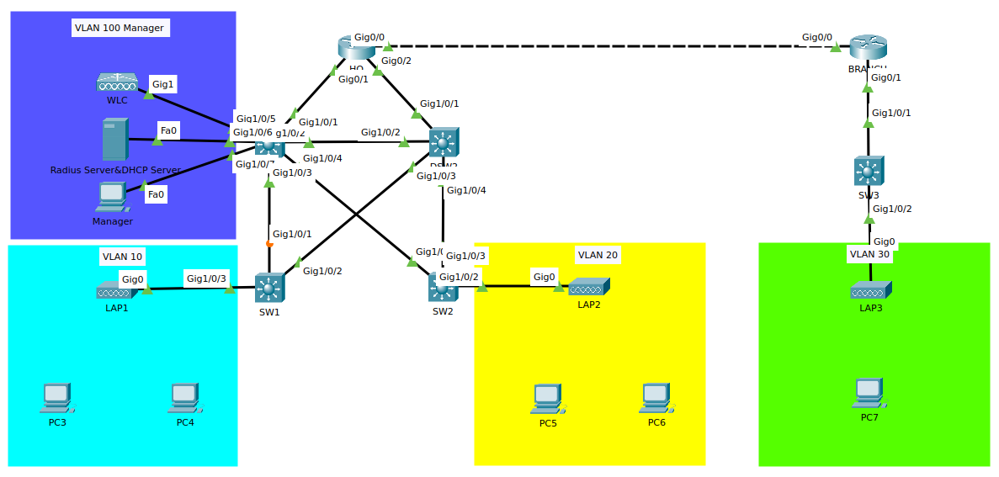
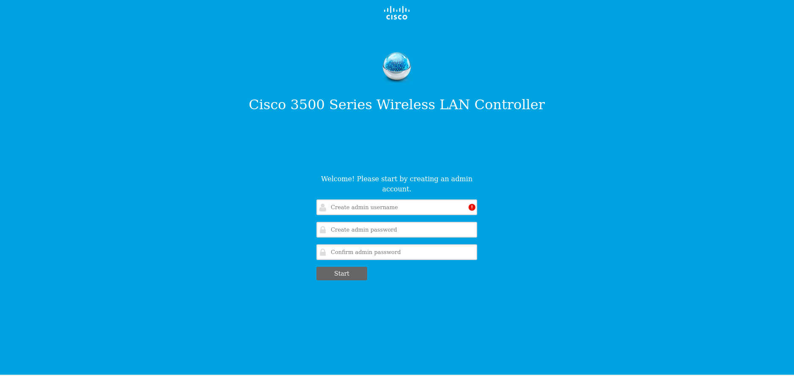

# WLC Initial #

## 實例 ##

此練習希望能幫助大家了解WLC基礎操作,Radius Server,以及總公司的WLC管理分公司Lightweight Access Point的方法，已預先配置好IP,HSRP,EIGRP,Rapid PVST+以及VLAN

## 拓樸 ##

## 初始化 ##
        
連接WLC與管理電腦，並開啟DHCP使IP自動取得，預設的Cisco WLC IP為192.168.1.1，取得IP後開啟瀏覽器並輸入http:\\192.168.1.1應該會出現以下畫面，接著創建使用者以及密碼之後按下Start
        

        

System Name：這台機器的名稱

Country：城市

Data & Time：時間

Timezone：時區

NTP Server：目前不用設定

Management IP Address：設定管理IP，日後使用此IP進入管理頁面

Subnet Mask：子網路遮罩

Default Gateway：預設閘道

Management VLAN ID：管理VLAN ID，先不設定

都輸入完成後，點選Next

 

Network Name：SSID名稱

Security：

WPA2 Personal - WPA2 Personal只需要設定Passphrase即可，較常用於家用網路，每個裝置的使用密碼相同，並且儲存於用戶端上，因此用戶端可以連線至網路並查看密碼
                
WPA2 Enterprise - 須連結到Redius Server進行用戶端身份驗證，較常用於企業部屬REDIUS環境下的無線網路，用戶不處理密碼，用戶端提供登入憑證後，可在後台安全的建立與分配用戶端的連線數
                
VLAN：目前不用設定
        
DHCP Server Address：目前不用設定
        
都輸入完成後，點選Next
        

        
目前不須設定，點選Next即可
        

        
確定設定都正確無誤，點選Apply 
        

        
會跳通知警告說系統將重新開機並配置剛剛的設定，點選OK
        

        
完成WLC的初始化
        
## 注意事項 ##
        
在Switch連接WLC的介面上開啟Trunk，並將Native VLAN設定為管理VLAN
        
    
