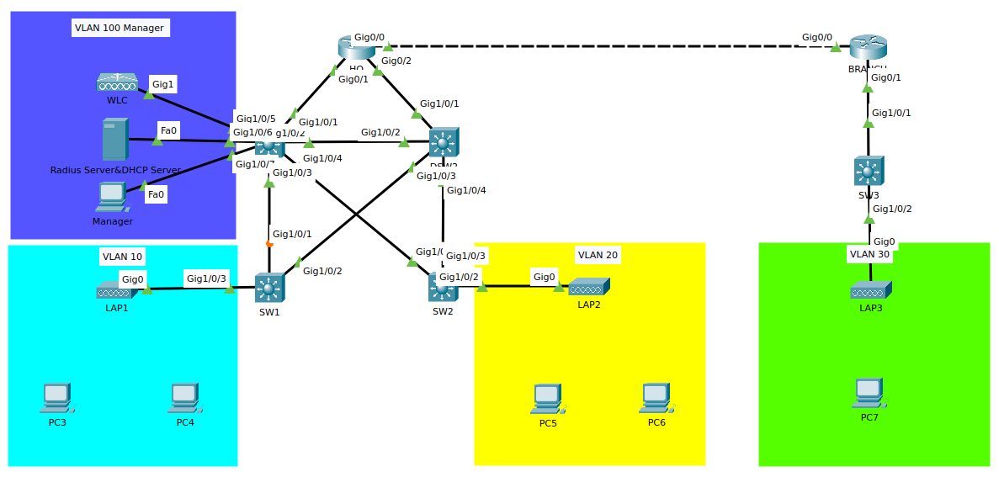
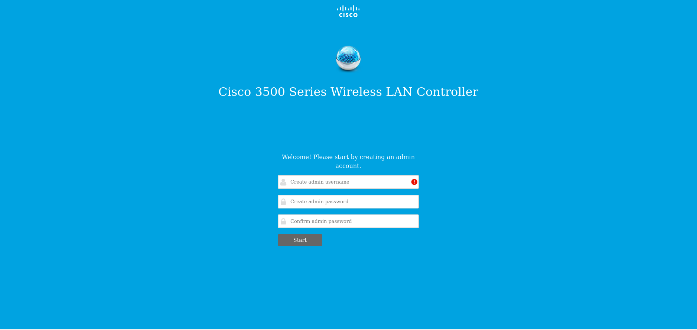

# WLC

## 簡介 ##

    Wireless LAN Controller 無線區域網路控制器，主要是用來讓企業和學校有多個AP環境時，能夠更只在網路控制器進行管理，不需要一台一台進行設定
    
## 使用技術 ##

### Flexconnect ###
    
    FlexConnect是一種分公司與遠端辦公的的解決方案，使你可以透過WAN在公司配置分公司的AP，而不用在每個分公司個別部屬網路控制器
        
### CAPWAP ###
        
    CAPWAP是Control And Provisioning of Wireless Access Points的縮寫，
        
    
### Local AP Mode 和 Flexconnect AP Mode的差別 ###
- Local AP Mode中，Lightweight AP會創建兩條CAPWAP Tunnel，一條用於管理，另一條用於資料傳輸，這種行為稱為Centrally switched(集中交換)，因為Lightweight AP須先將資料流量送給Controller接著才會進行路由
- flexconnect允許資料傳輸在本地進行交換不須回到Controller，每一台Lightweight AP就像是一般AP一樣自行管理資料流量，但實際是從WLC進行管理，此模式中，即使Lightweight AP AP與WLC斷開連線，仍可以正常工作
    
## 實例 ##

    此練習希望能幫助大家了解WLC基礎操作,Radius Server,以及總公司的WLC管理分公司Lightweight Access Point的方法，以預先配置好IP,HSRP,EIGRP,Rapid PVST+以及VLAN

### 拓樸 ###

### 初始化 ###
        
    連接WLC與管理電腦，並開啟DHCP使IP自動取得，預設的Cisco WLC IP為192.168.1.1，取得IP後開啟瀏覽器並輸入http:\\192.168.1.1應該會出現以下畫面，接著創建使用者以及密碼之後按下Start
        

        

        System Name：這台機器的名稱
        
        Country：城市
        
        Data & Time：時間
        
        Timezone：時區
        
        NTP Server：目前不用設定
        
        Management IP Address：設定管理IP，日後使用此IP進入管理頁面
        
        Subnet Mask：子網路遮罩
        
        Default Gateway：預設閘道
        
        Management VLAN ID：管理VLAN ID，先不設定
        
        都輸入完成後，點選Next
 

    Network Name：SSID名稱
    Security：
    WPA2 Personal - WPA2 Personal只需要設定Passphrase即可，較常用於家用網路，每個裝置的使用密碼相同，並且儲存於用戶端上，因此用戶端可以連線至網路並查看密碼
                
    WPA2 Enterprise - 須連結到Redius Server進行用戶端身份驗證，較常用於企業部屬REDIUS環境下的無線網路，用戶不處理密碼，用戶端提供登入憑證後，可在後台安全的建立與分配用戶端的連線數
                
    VLAN：目前不用設定
        
    DHCP Server Address：目前不用設定
        
    都輸入完成後，點選Next
        

        
    目前不須設定，點選Next即可
        

        
    確定設定都正確無誤，點選Apply 
        

        
    會跳通知警告說系統將重新開機並配置剛剛的設定，點選OK
        

        
    完成WLC的初始化
        
### 注意事項
        
    在Switch連接WLC的介面上開啟Trunk，並將Native VLAN設定為管理VLAN
        
    
