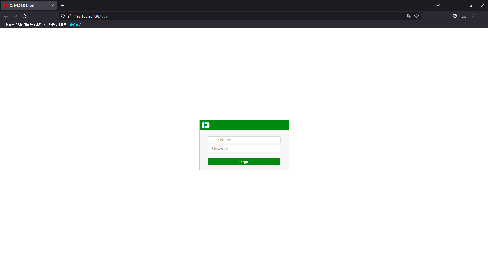
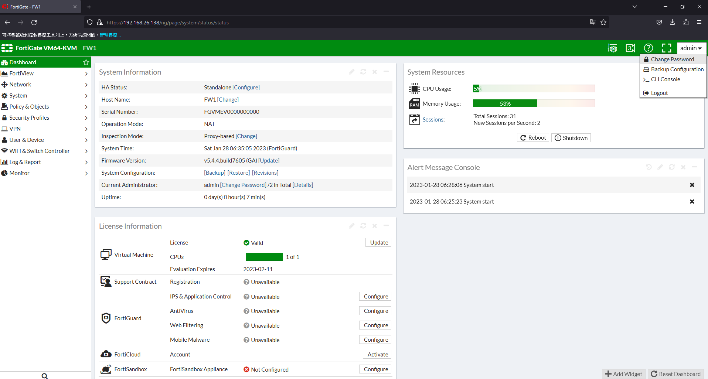
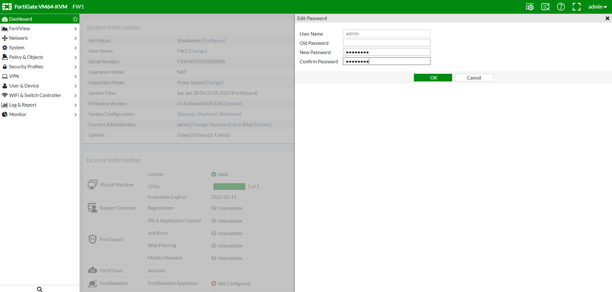

# Change password #

>更改Fortigate管理密碼

## Graphical User Interface ##

打開browser輸入https://<ip address>進入管理頁面並登入，預設帳號為admin，密碼為空



點選右上角admin會出現下拉選單，選擇Change Password



輸入舊密碼和新密碼就完成了



## Command Line ##

```bash
config system admin 
    edit admin 
    set password P@ssw0rd
    end
```