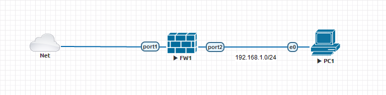
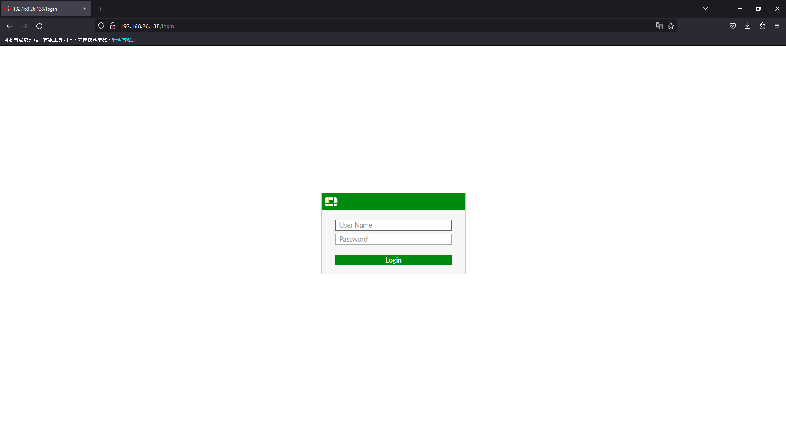
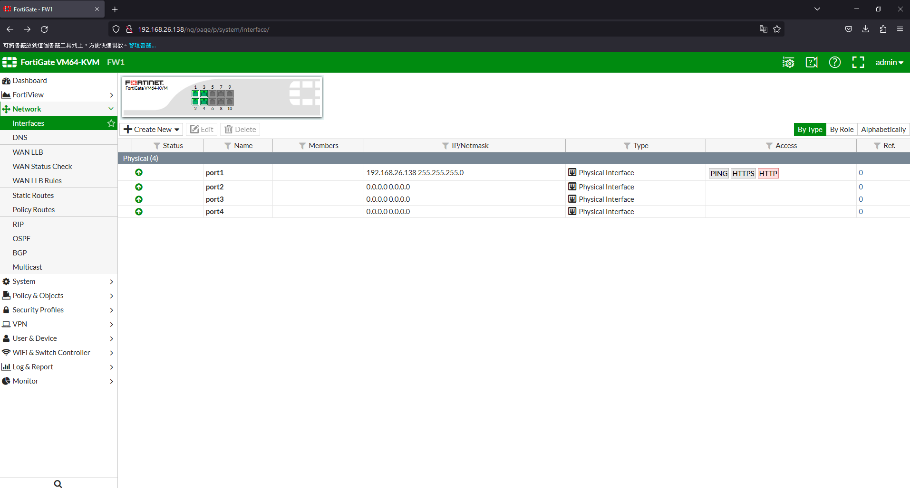
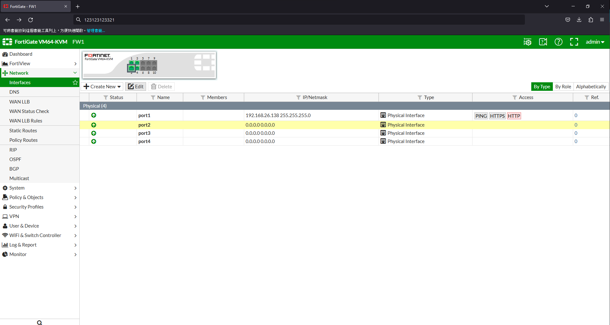
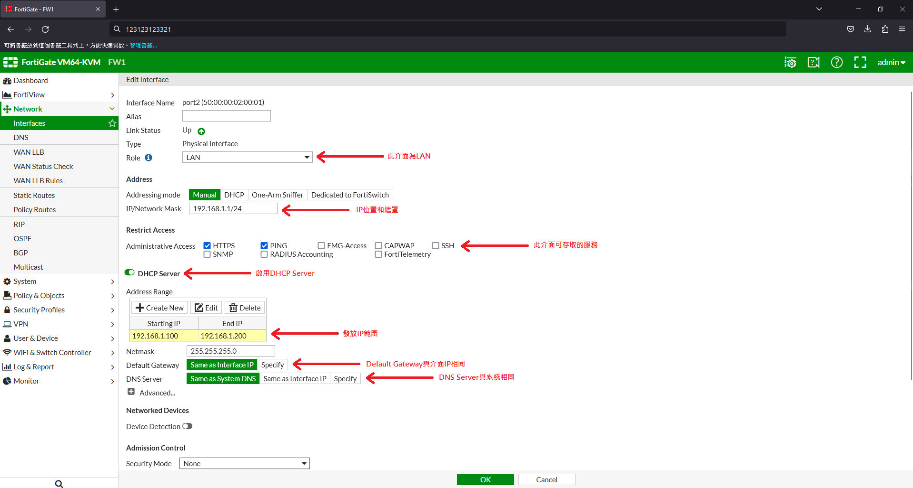
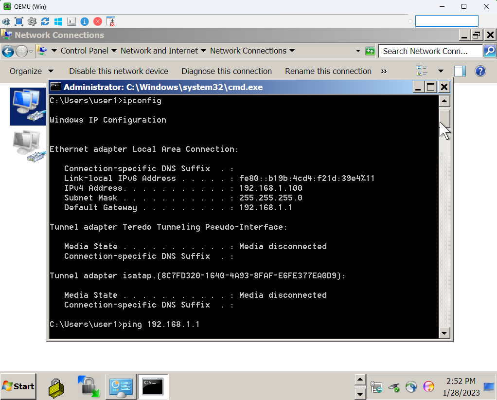

# DHCP #

## Topology ##



## Graphical User Interface ##

打開browser輸入https://<ip address>進入管理頁面並登入，預設帳號為admin，密碼為空



左側列表選擇Network -> Interface 



選擇Port2，按下Edit 



填選以下欄位，填完選擇OK即可



將PC改為自動取得，使用ipconfig查看是否成功取得IP



## Command Line ##

初始化

```bash
config system global 
    set hostname FW1
config system interface 
    edit port1 
    set mode dhcp 
    set allowaccess ping https 
    next
    edit port2 
    set ip 192.168.1.1 255.255.255.0
    set allowaccess ping https 
end
```

配置DHCP

```bash
config system dhcp server
    edit 1
        set status enable #啟用DHCP Server
        set lease-time 86400 #租約時間
        set dns-server1 8.8.8.8 #DNS Server
        set default-gateway 192.168.1.1
        set netmask 255.255.255.0
        set interface port2
        config ip-range 
            edit 1
                set start-ip 192.168.1.100 
                set end-ip 192.168.1.200
                next
        end
```