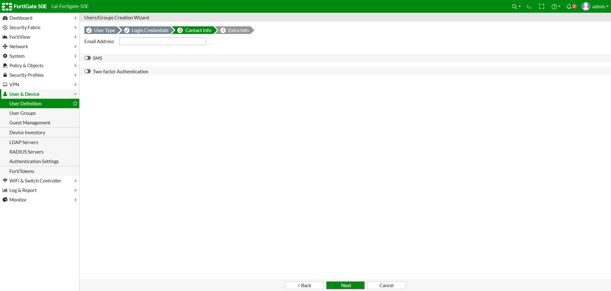

# SSL VPN #

## 配置步驟 ##

1. 建立使用SSLVPN的使用者和群組
2. 配置SSL-VPN Portals
3. 配置SSL-VPN Settings
4. 配置Firewall Policy 

## 建立使用SSLVPN的使用者和群組 ##

點選Create New 

可以選擇適合組織的使用者類型，接著下一步

輸入使用者名稱與密碼

可輸入Email、SMS與2FA

啟用帳號，完成

接著點選左側列表User Groups

點選Create New後，輸入群組名稱，並加入剛剛建立的使用者
 

## 配置SSL-VPN Portals ##

## 配置SSL-VPN Settings ##

## 配置Firewall Policy ##

