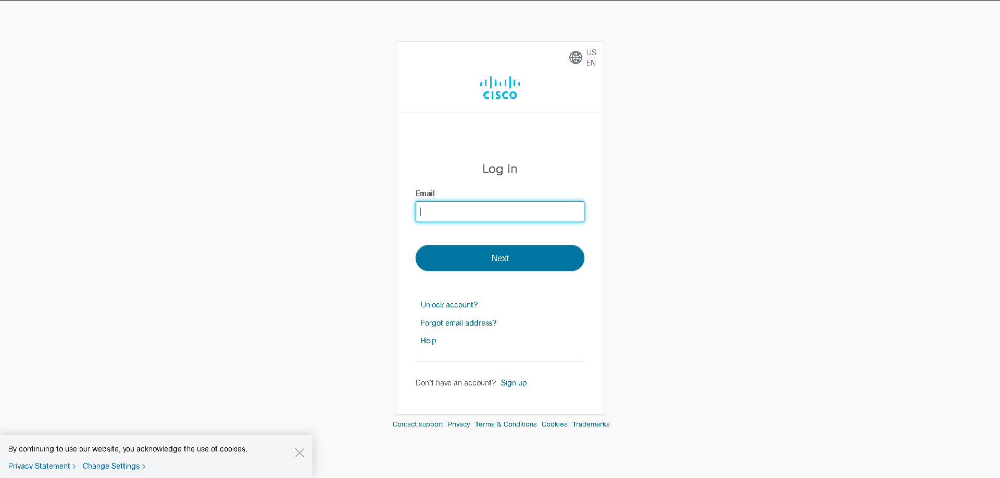
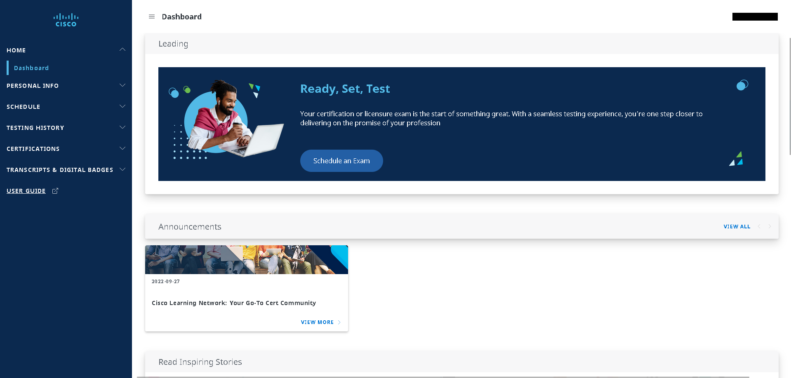
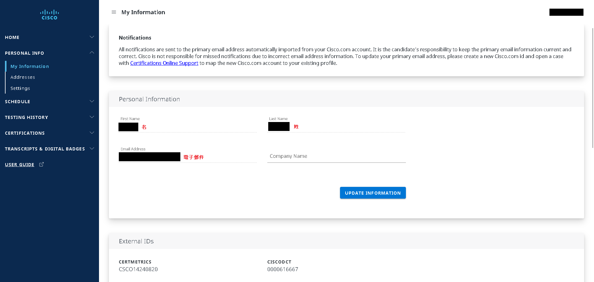
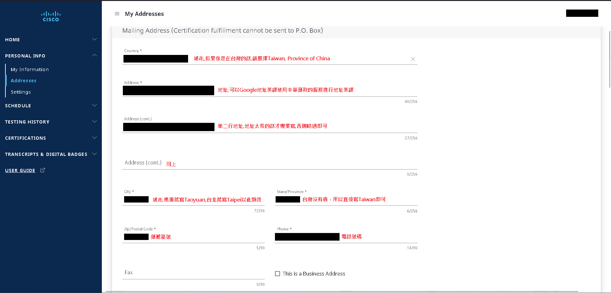
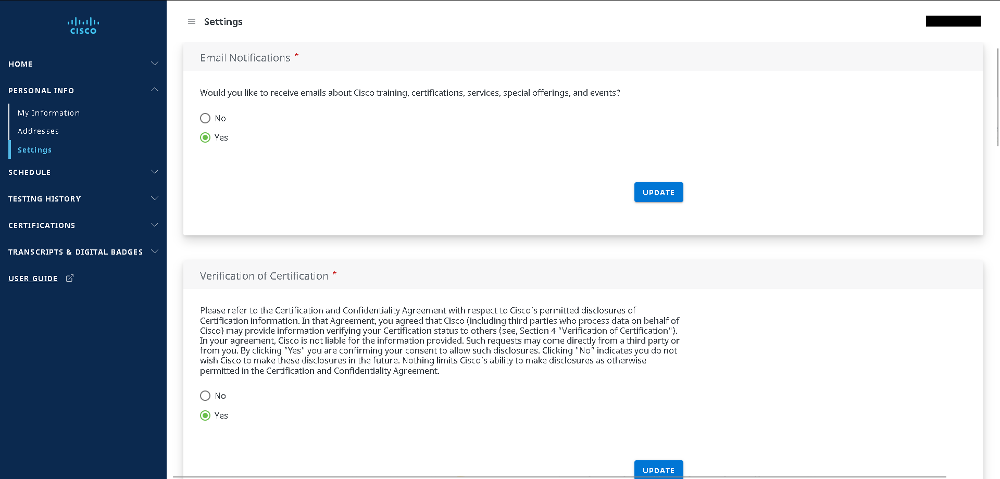
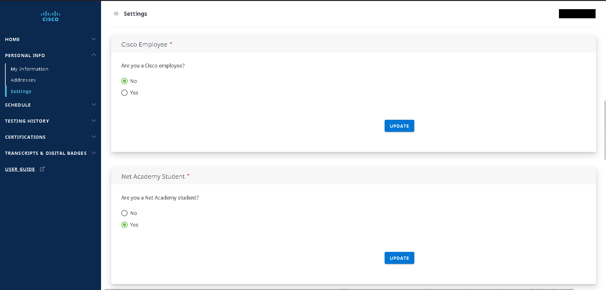
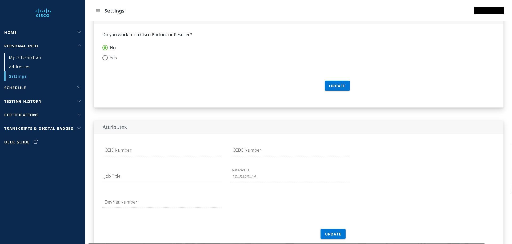
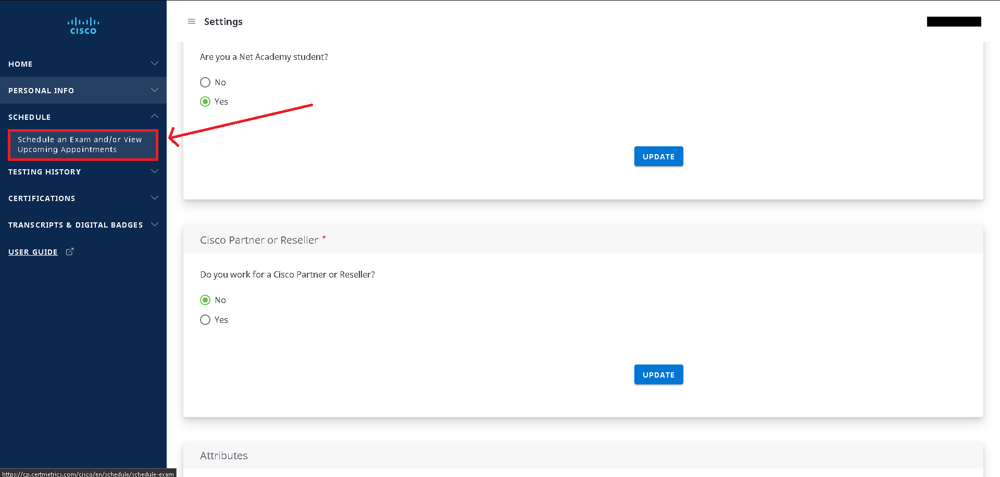
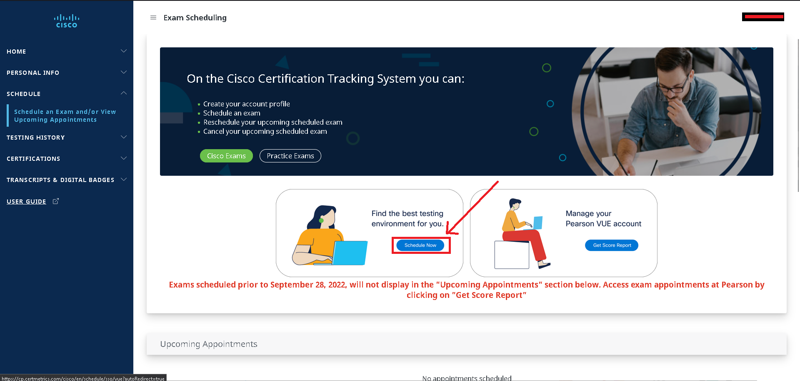
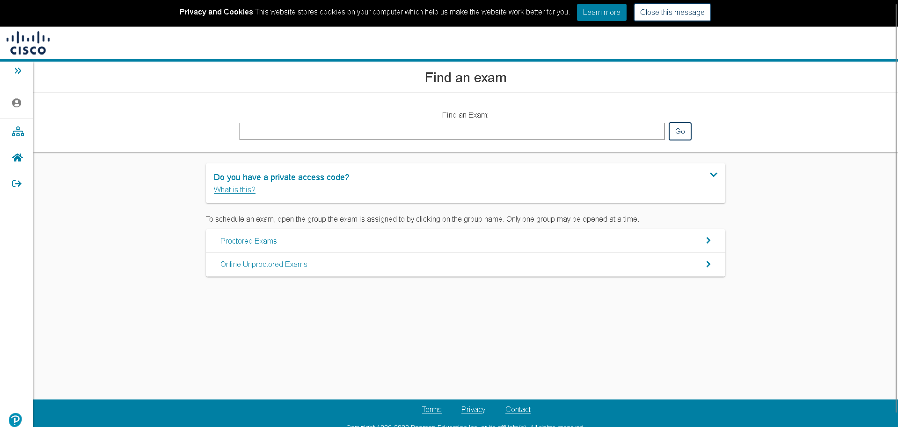

# 如何安排Cisco認證考試 #

進入Certification Tracking System https://cp.certmetrics.com/cisco/en/home/dashboard

## 1.登入或註冊 ##

如果你是第一次安排Cisco認證考試，請點選Sign up並創建帳號，如果你已經擁有帳號，請登入，注意，請勿創建相同個人資料的帳號

## 2.填寫個人信息 ##

進入主畫面後，請點選左方PERSONAL INFO並將My Information,Addresses,Settings的資料都填寫完成

## My Information ##

## Addresses ##

## Settings ##

在Settings這邊會有幾個問題請大家依序回答

## 3.安排考試 ##

以上步驟都完成後，請點選左方列表中的SCHEDULE -> Schedule an Exam and/or View Upcoming Appointments

點選Schedule Now

點選後會進入VUE

搜尋CISCO

