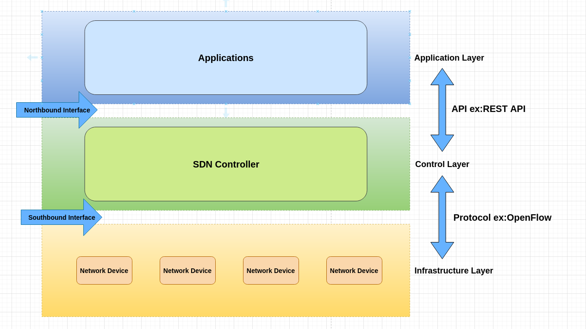

# Introduction #

SDN是一種新型的網路結構，利用[OpenFlow](OpenFlow.md)將路由器中的control plane以及data plane分離，將協議運算於控制器處理，轉發由網路設備進行，使管理員能夠在不更動實體設備的狀況下，能夠以中央控制方式用程式重新規劃網路

## 傳統網路結構 ## 

    傳統網路為分散式控制架構，每台設備均有獨立的management plane,control plane以及data plane，須於每台設備配置管理IP進行管理，若企業規模較大時，管理設備會變得相當繁瑣並且錯誤率較高，且不同廠牌操作差異大，支援協定不相同，對維護人員技能要求高
    Management plane - 用於監控與管理網路設備，如SNMP
    Control plane    - 用於計算路由協定生成路由表，如RIP,EIGRP,OSPF
    Data plane       - 根據Control plane生成出的結果進行轉發處理，如FIB(Forwarding information Base 轉發表)

## SDN架構介紹 ##
    
### SDN優點 ###

    1.轉控分離 - 將control plane及data plane分離，使硬體能夠更專注於轉發與儲存能力，計算與處理路由等功能由控制器執行
    2.集中控管 - 不須每台設備逐一配置，只須對控制器進行配置即可
    3.開放標準 - 基於開放標準，能夠在不同供應商中提供一致的網路

### SDN架構 ###

    SDN將架構分為三層，分別為Application Layer,Control Layer和Infrastructure Layer，分別用作以下用途
    Application Layer    - 定義對使用者所提供的服務
    Control Layer        - 以SDN Controller負責集中控管底下的SDN Switch，例如商業的Cisco Open SDN Controller或者開源的的Ryu等...
    Infrastructure Layer - 由基礎設施組成，負責管理實體網路設備

## Interface ##

    Northbound Interface - 透過API使Application Layer與Control Layer溝通，主要使用REST API
    Southbound Interface - 透過協定使Control Layer與Infrastructure Layer能夠溝通，主要協定為OpenFlow,NetConf和OVSDB