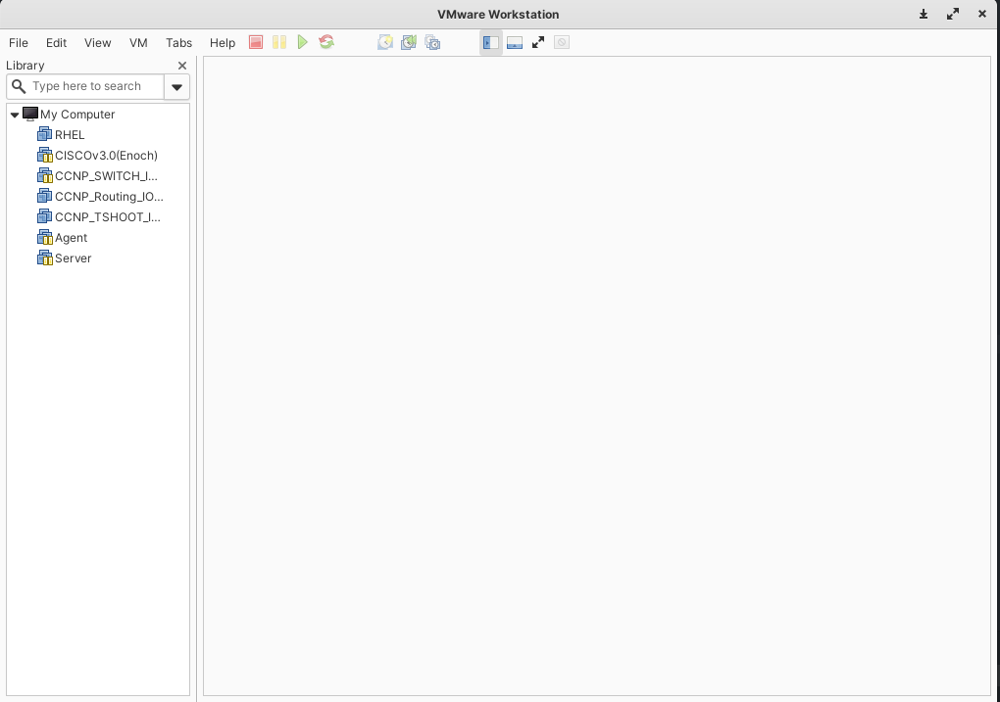

# 實驗環境搭建 #

## EVE-NG ##

使用EVE-NG須先擁有VMware workstation play or VMware workstation Pro

### 1. 開啟VMware workstation Pro ###



### 2.點選File -> Open -> 選取要開啟的檔案，編輯名稱後開啟即可 ###

## TroubleShooting ##
### 
```bash
#Error Couldn't run /usr/bin/dumpcap in child process: Permission denied when starting Wireshark 因權限不足，無法開啟Wireshark進行抓包，將使用者加入群組wireshark即可
sudo usermod -aG wireshark $USER
sudo dpkg-reconfigure wireshark-common
```
